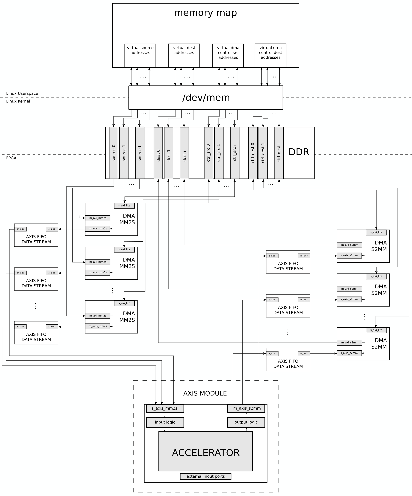
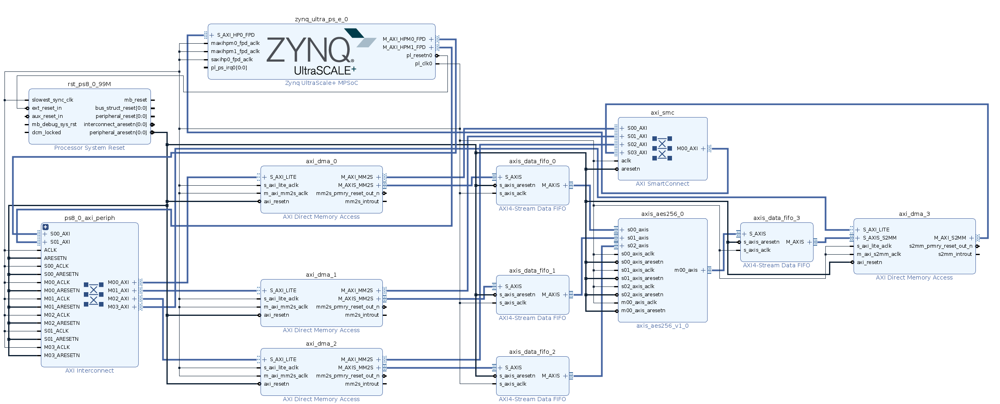
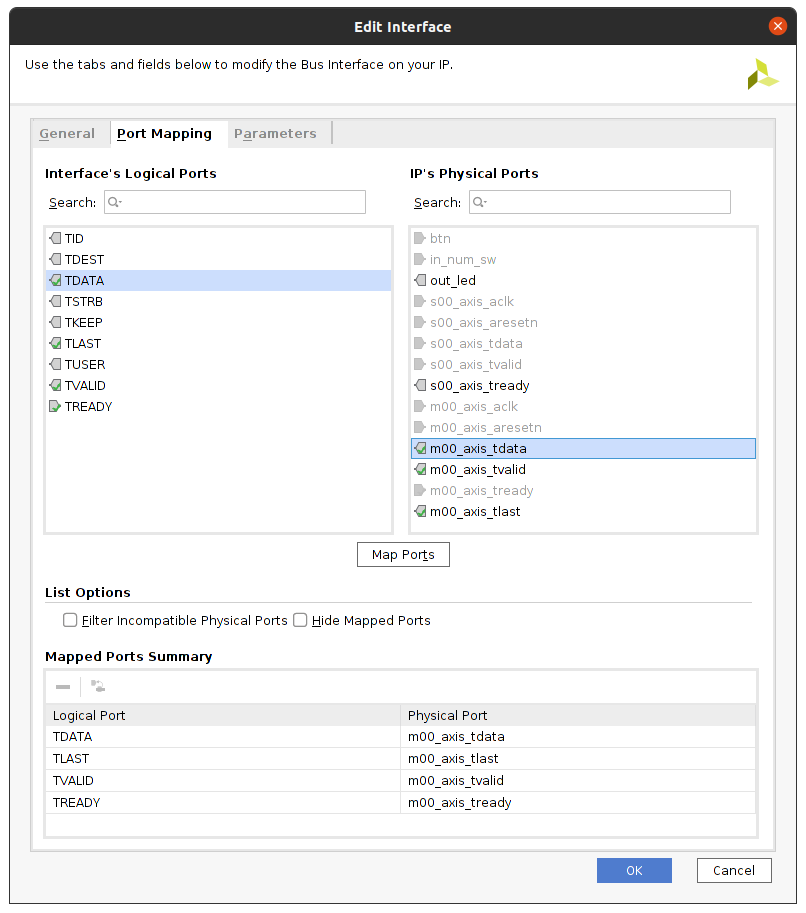
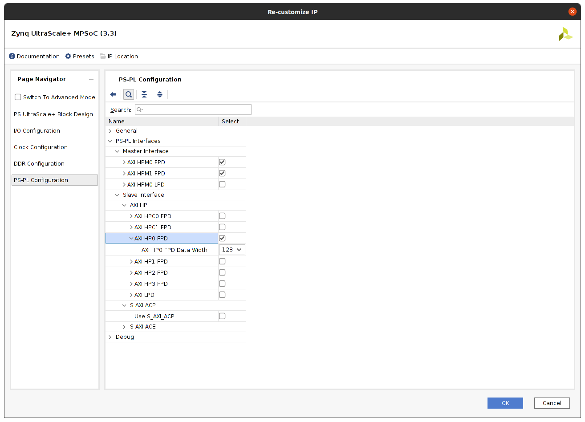
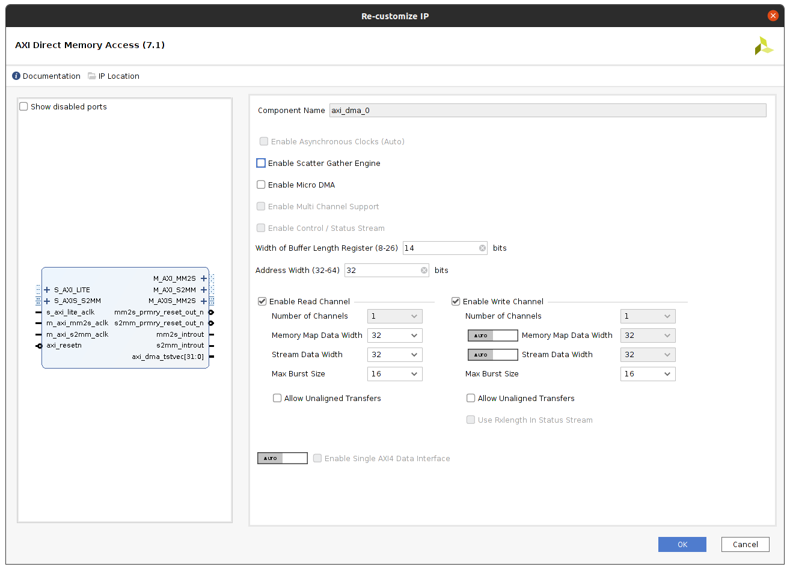

The communication management between the Processing System (ARM) and the Programmable Logic (FPGA) sides is one the most important features needed by a [heterogeneous system OS](yoctofpga), in order to develop software applications which exploit the hardware acceleration of FPGAs.

**Last update the 11/05/2022** - Tutorial created by R. Meloni the 25/03/2022

## Contact us
If you encounter errors or if you have any doubts, please open an <a href="https://github.com/mdc-suite/mdc-suite.github.io/issues" target="_blank">issue</a> on GitHub, or send an e-mail to:

    Raffaele Meloni - raffaele.meloni99@gmail.com


## Direct Memory Access
The Direct Memory Access (DMA) is a method for accessing the main memory (DDR) without tying up the CPU, and therefore leaving it available to perform other operations during the reading.

This guide shows* how to develop a **heterogeneous application**  whose communication has been implemented using <a href="https://www.xilinx.com/support/documentation/ip_documentation/axi_dma/v7_1/pg021_axi_dma.pdf" target="_blank">AXI DMA</a> and <a href="https://www.xilinx.com/support/documentation/ip_documentation/ug761_axi_reference_guide.pdf" target="_blank">AXI-Stream interface modules</a> and consisting of two main parts,:
 - **Hardware application**, running on the FPGA, made up by a custom hardware accelerator used to speed up the most onerous operations.
 - **Software application**, running on the CPU, delegated for control operations, such as the communication management, and the least onerous operations.

<div class="note">
*This guide is partially derived by <a href="https://www.hackster.io/whitney-knitter/introduction-to-using-axi-dma-in-embedded-linux-5264ec" target="_bank">Introduction to Using AXI DMA in Embedded Linux</a> and it has been adapted to use the DMA by Yocto linux OS with a custom accelerator
</div>

### Schematic



### Communication protocol
The **software** application is a C-based application in the Linux Userspace. It accesses the DDR through the `/dev/mem` file using <a href="https://man7.org/linux/man-pages/man2/mmap.2.html" target="_blank">mmap()</a>, it handles the DMA control addresses, and it writes data (MM2S) in the source addresses, then it waits the hardware application and, once data come back, it reads data (S2MM) from destination addresses.

On the **hardware** side, the DMAs access the DDR directly through their Slave AXI Lite interface (s axi lite). The MM2S DMAs read data from DDR and send them to the accelerator through the input AXI FIFOs Data Stream, making them available to the accelerator. The processed data are sent back to the output AXI FIFOs Data Stream, and then to S2MM DMAs which will write data in the DDR.

In order to **evaluate the communication**, a hardware accelerator which implements the Advanced Encryption Standard with 256 bit key and 128 bit text (AES256) has been used.

## Hardware Application
The final hardware application is a *.bin file, generated by the <a href="https://www.xilinx.com/support/documentation-navigation/design-hubs/dh0009-vivado-using-ip-integrator-hub.html" target="_blank">Vivado IP integrator</a>, which can be loaded by the [software application](#software-application-on-os). The ZynqMP processing system **DMA built-in channels** allow only memory-to-memory transfers, not stream-to-memory or memory-to-stream transfers. Custom IPs like accelerators, peripherals, and any other hardware block, which are ”stream oriented”, need a specific interface: the **AXI DMA IP**. It allows any block with the **AXI Stream (AXIS)** interface to access the DDR for receiving and sending data – in other words, it **allows the communication between PS and PL**. Thus, the hardware application consists of four main blocks:
 - AXI DMA IP blocks
 - AXI4-Stream Data input FIFOs
 - AXI4-Stream Data output FIFOs
 - Custom IP block with AXIS interface

    

The steps needed to create such application are:
1. [Create a custom IP block](#create-a-custom-ip-block)
2. [Connect DMA, custom IP and Processing System blocks](#connect-dma-custom-ip-and-rocessing-system)
3. Edit XDC (external ports only)
4. [Generate bitstream](#generate-bitstream)

<!-- <div  style="background-color:#e8e8e8; padding:15px; border-radius:5px; font-style:italic; font-size:0.7em"> -->
<div class="note">
*FIFOs are not strictly necessary, but they allow to speed up and to make easier the communication. In fact, they receive data from DMA, make data available to logic with a known interface, and send processed data back to DMA
</div>

### Create a custom IP block
The first step is to create the custom IP block with an AXIS interface, starting from a Verilog module.

#### Top module interface
```verilog
module axis_top_hw #( parameter C_AXIS_TDATA_WIDTH = 32)
(
  // User inputs

  // User outputs

  /*
  * AXIS slave interface ( input data )
  */
  input wire  s00_axis_aclk,
  input wire  s00_axis_aresetn,
  input wire [C_AXIS_TDATA_WIDTH-1:0] s00_axis_tdata,  	 // input data
  input wire  s00_axis_tvalid,                           // input data valid
  output wire  s00_axis_tready,                          // slave ready
  // input wire  s00_axis_tlast,                         // not used

  /*
  * Other AXIS slaves
  */
  // input wire  s0i_axis_aclk,
  // input wire  s0i_axis_aresetn,
  // input wire [C_AXIS_TDATA_WIDTH -1:0] s0i_axis_tdata,   // input data
  // input wire  s0i_axis_tvalid,                           // input data valid
  // output wire  s0i_axis_tready,                          // slave ready

  /*
  * AXIS master interface (output data)
  */
  input wire  m00_axis_aclk,
  input wire  m00_axis_aresetn,
  output wire [C_AXIS_TDATA_WIDTH-1:0] m00_axis_tdata,    // output data
  output wire  m00_axis_tvalid,                           // output data valid
  input wire  m00_axis_tready,                            // output ready
  output wire  m00_axis _tlast                            // data last signal

  /*
  * Other AXIS masters
  */
  // input wire  m0i_axis_aclk,
  // input wire  m0i_axis_aresetn,
  // output wire [C_AXIS_TDATA_WIDTH -1:0] m0i_axis_tdata,  // output data
  // output wire  m0i_axis_tvalid,                          // output data valid
  // input wire  m0i_axis_tready,                           // output ready
  // output wire  m0i _axis_t last                          // data last signal
  );

  // External inputs (switches , pushbuttons etc .)


  // Input slave logic

  // Accelerator

  // Output master logic


  // External outputs (leds etc .)

  endmodule
``` 

[axis_aes256.v](axis_aes.v) provides a real example of the top module template. It has three 8-bit input data (text_data, key_data, and rc_data) and one 8-bit output data (chiped_text_data). All data come from CPU and the output is sent to CPU, so, the module interface is compounded by 3 axis slaves for the inputs and 1 axis master for the output. The input logic consists of 3 input FIFOs and the output logic consists of an output FIFO.

The **m0i_axis_tlast signal** is very important, since it signals to the DMA that m0i_axis_tdata is the last one, allowing the DMA to send the interrupt properly. So, rising it up when the last data has been sent is needed. Specifically, in axis_aes256.v, the tlast signal is handled by a counter and it is raised while the 16th output is outcoming.


#### Package the IP
Once the verilog top module is written, it is necessary to package it into an IP block. To do that from the Vivado project, open ’Tools’ and then choose ’Create and Package new IP’.
<!-- <details>
<!-- <summary>Click to see the switches configuration</summary> -->
<!-- 
</details> -->


Click next and then select ’Package your current project’, choose the IP location and click ’Finish’, the ’tmp’ project will be opened. At this point, make sure the ports and the interfaces are properly connected.


#### Map the ports
Usually the ports are automatically mapped, but if not, click ’+’ and add master and slave interface. Choose the interface definition (’axis rtl’, mode ’master’ or ’slave’), and map ’TDATA’, ’TLAST’ (master only), ’TVALID’ and ’TREADY’.




Finally, package the IP.


### Connect DMA, custom IP and Processing System
Once the custom IP has been created and added to the repository IP Catalog, open a new project, create a new Block Design and connect all components.
 1. Add **Zynq UltraScale+ MPSoc** IP block for the PS side, click run block automation (Apply Board Preset) and edit 'PS-PL Configuration' checking 'AXI HP0 FPD'.
   
   
 2. Add the **AXI Direct Memory Access** IP block, disable 'Enable Scatter Gather Engine' (leave the remaining options as default) and click run block automation again (check 'All Automation'). The schematic shows a system with only one DMA, but if your custom IP has multiple slaves and/or multiple masters, you need to add a "input MM2S DMA" ('Enable write channel' disabled) for each slave and a "output S2MM DMA" ('Enable read channel' disabled) for each master.
   
   
 3. Add the input and output **AXI4-Stream Data FIFO** (one for each slave/master interface respectively), and the custom IP with AXIS interface.
     - Connect the Master interface of DMA to Slave interface of input FIFO (**M_AXIS_MM2S** and **S_AXIS**);
     - Connect the Master interface of input FIFO to Slave interface of custom IP (**M_AXIS** and  **s00_axis**);
     - Connect the Master interface of custom IP to Slave interface of output FIFO (**m00_axis** and  **S_AXIS**);
     - Connect the Master interface of output FIFO to Slave interface of DMA (**M_AXIS** and  **S_AXIS_S2MM**);
     - Run connection automation.

    
 
 4. If the custom IP has external input/output ports, right click and then 'Make External'.

    
 
 5. Validate block design.

Once all components are connected save the block design, go to sources, right click on 'design_file_name', and choose 'Create HDL wrapper' (Let Vivado manage wrapper and auto-update) -- it will create a *.v version of the Block Design. 
<div class="note">
If you edit the block design, re-run 'Validate block design' before creating the wrapper.
</div>

### Generate bitstream
If the custom IP has external ports, download the XDC from the official site and connect **only** the external ports.
Run synthesis, implementation and bitstream (make sure that in project settings, bin file generation has been selected). Make sure that neither critical warnings nor errors appear.

## Software Application on OS
In order to use the bitstream by the Linux Userspace, please see [Yocto FPGA programming](https://mdc-suite.github.io/miscellaneous/yoctofpga#fpga-programming). The core is a C application which loads the accelerator and uses the memory map engine to control the DMA for communication, <a href="https://www.xilinx.com/support/documentation/ip_documentation/axi_dma/v7_1/pg021_axi_dma.pdf" target="_blank">AXI DMA v7.1 - AXI DMA Register Address Map</a>. It manages the communication writing and reading and the DMA control registers of the DDR. Source code: [dma_sample_app.c](dma_sample_app.c).
1. **Load the accelerator** using fpgautil.
```c
system ("fpgautil -b aes256_dma.bin");
```
2. Open the **ddr memory**.
```c
int ddr_memory = open ("/dev/mem", O_RDWR | O_SYNC);
```
3. Use mmap() for **mapping the DMA** control addresses and data addresses*.
```c
// DMAs MM2S
unsigned int *dma_mm2s00_virtual_addr = mmap(NULL, 65535, PROT_READ | PROT_WRITE, MAP_SHARED, ddr_memory, OFFS_DMA_IN00_DATA);   
unsigned int *dma_mm2s0i_virtual_addr = mmap(NULL, 65535, PROT_READ | PROT_WRITE, MAP_SHARED, ddr_memory, OFFS_DMA_IN0i_DATA);
// DMA S2MM
unsigned int *dma_s2mm00_virtual_addr = mmap(NULL, 65535, PROT_READ | PROT_WRITE, MAP_SHARED, ddr_memory, OFFS_DMA_OUT00_DATA);  
unsigned int *dma_s2mm0i_virtual_addr = mmap(NULL, 65535, PROT_READ | PROT_WRITE, MAP_SHARED, ddr_memory, OFFS_DMA_OUT0i_DATA);
/* ************************************************************************************************************************ */
// SOURCE ADDRESSES
unsigned int *virtual_src_00_addr = mmap(NULL, 65535, PROT_READ | PROT_WRITE, MAP_SHARED, ddr_memory, OFFS_SRC_00);
unsigned int *virtual_src_0i_addr = mmap(NULL, 65535, PROT_READ | PROT_WRITE, MAP_SHARED, ddr_memory, OFFS_SRC_0i);
// DESTINATION ADDRESSES
unsigned int *virtual_dst_00_addr = mmap(NULL, 65535, PROT_READ | PROT_WRITE, MAP_SHARED, ddr_memory, OFFS_DST_00);
unsigned int *virtual_dst_0i_addr = mmap(NULL, 65535, PROT_READ | PROT_WRITE, MAP_SHARED, ddr_memory, OFFS_DST_0i);
```

4. **Write data** in source data virtual addresses.
5. **Reset**, **halt** the DMAs, and enable all **interrupts**.
```c
// RESET ALL THE MM2S DMAs
write_dma(dma_mm2s0i_virtual_addr, MM2S_CONTROL_REGISTER, RESET_DMA);
// RESET ALL THE S2MM DMAs
write_dma(dma_s2mm0i_virtual_addr, S2MM_CONTROL_REGISTER, RESET_DMA);
/* ************************************************************************************************************************ */
// HALT THE DMAs
write_dma(dma_mm2s0i_virtual_addr, MM2S_CONTROL_REGISTER, HALT_DMA);
write_dma(dma_s2mm0i_virtual_addr, S2MM_CONTROL_REGISTER, HALT_DMA);
/* ************************************************************************************************************************ */
// ENABLE INTERRUPTS
write_dma(dma_mm2s0i_virtual_addr, MM2S_CONTROL_REGISTER, ENABLE_ALL_IRQ);
write_dma(dma_s2mm0i_virtual_addr, S2MM_CONTROL_REGISTER, ENABLE_ALL_IRQ);
```
6. **Write** the source and destination **addresses**.
```c
// WRITE ALL THE SOURCE ADDRESSES
write_dma(dma_mm2s0i_virtual_addr, MM2S_SRC_ADDRESS_REGISTER, OFFS_SRC_0i);
// WRITE ALL THE DESTINATION ADDRESSES
write_dma(dma_s2mm0i_virtual_addr, S2MM_SRC_ADDRESS_REGISTER, OFFS_DST_0i);
```
7. **Run the MM2S** and **S2MM channels**, and the write **transfer lengths**.
```c
// RUN THE MM2S DMAs
write_dma(dma_mm2s0i_virtual_addr, MM2S_CONTROL_REGISTER, RUN_DMA);
// RUN THE S2MM DMAs
write_dma(dma_s2mm0i_virtual_addr, S2MM_CONTROL_REGISTER, RUN_DMA);
/* ************************************************************************************************************************ */
// WRITE TRANSFER LEGHTs
write_dma(virtual_src_0i_addr, MM2S_TRNSFR_LENGTH_REGISTER, SRC0i_LENGTH);
write_dma(virtual_dst_0i_addr, S2MM_TRNSFR_LENGTH_REGISTER, DST0i_LENGTH);
```
8. **Wait** for MM2S and S2MM **synchronizations**.
```c
// WAIT MM2S SYNCH
dma_mm2s_sync(dma_mm2s0i_virtual_addr);
// WAIT S2MM SYNCH
dma_s2mm_sync(dma_s2mm0i_virtual_addr);
```

9. Unmap virtual addresses and close the ddr memory.
```c
// UNMAP MM2S
munmap(dma_mm2s00_virtual_addr, 65535);
munmap(dma_mm2s0i_virtual_addr, 65535);
// UNMAP S2MM
munmap(dma_s2mm00_virtual_addr, 65535);
munmap(dma_s2mm0i_virtual_addr, 65535);
// UNMAP SOURCE VIRTUAL ADDRESSES
munmap(virtual_src_00_addr, 65535)
munmap(virtual_src_0i_addr, 65535)
// UNMAP DESTINAION VIRTUAL ADDRESSES
munmap(virtual_dst_00_addr, 65535)
munmap(virtual_dst_0i_addr, 65535)
/* ************************************************************************************************************************ */
// CLOSE DDR
close(ddr_memory);
```
<div class="note">*The offset of DMAs are visible from the Vivado address editor</div>
[dma_sample_app.c](dma_sample.c) is an example to test the communication management via mmap and DMA, I have planned to implement an API to simplify it further.
